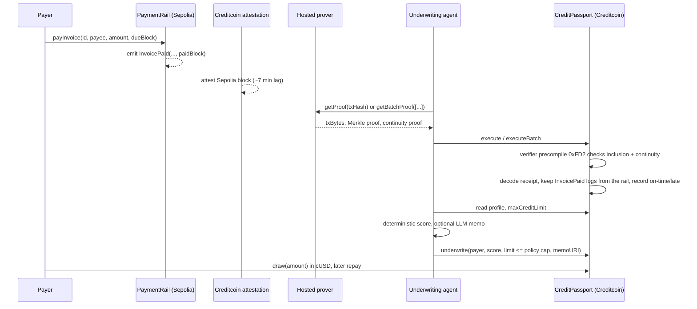

# CreditPassport

A portable credit history on Creditcoin, built only from payments that provably
happened on another chain, with a credit line underwritten against it by an
agent whose discretion is bounded on-chain.

Built for BUIDL CTC 2026 Fall (Creditcoin, Attestcoin Protocol). Track: AI,
with DeFi as the fallback.

## The problem

Credit needs history, and history lives where payments happen. Today the only
ways to move that history are a centralized oracle that asserts "this address
paid its invoices," or self-reported data. Both put a trusted party between the
facts and the lender. Attestcoin removes that party: Creditcoin attests source
chain blocks, and a contract on Creditcoin can verify that a specific
transaction, with a specific receipt, was included. CreditPassport turns those
verified receipts into a credit profile and a credit line.

## How it works



Three parts:

1. **Contracts** (`contracts/`, Foundry).
   - `source/PaymentRail.sol` on the source chain settles invoices in a test
     stablecoin and emits `InvoicePaid(invoiceId, payer, payee, amount,
     dueBlock, paidBlock)`.
   - `AttestedBase.sol` on Creditcoin verifies proofs through the Native Query
     Verifier precompile. Modeled on `ASCBase` from `@gluwa/asc-contracts`; it
     keeps the same query-id replay protection and adds source-chain binding
     and a batch path (`executeBatch`, up to 10 transactions sharing one
     continuity proof).
   - `CreditPassport.sol` decodes the proven receipt with `EvmV1Decoder`,
     accepts only `InvoicePaid` logs emitted by the registered rail (or
     `Transfer` logs of the registered token as undated payments), records
     each payment, enforces the underwriting policy, and runs the credit line.
2. **Agent** (`agent/`, TypeScript). Watches the rail, waits for attestation,
   fetches proofs from the hosted prover, dry-runs them against the precompile,
   submits singles or batches, then scores and underwrites. Exposes a JSON
   status endpoint for the web app.
3. **Web** (`web/`, coming next): passport view with verified payments, proof
   links, score, limit, memo, and live attestation lag.

### Where Attestcoin is used

| Piece | Attestcoin surface |
| --- | --- |
| `AttestedBase.execute` | `INativeQueryVerifier.verifyAndEmit` (single) at `0xFD2` |
| `AttestedBase.executeBatch` | `INativeQueryVerifier.verifyAndEmit` (batch overload) |
| `AttestedBase._computeQueryId` | `calculateTxIndex`, same derivation as `ASCBase` |
| `CreditPassport._processAndEmitEvent` | `EvmV1Decoder.decodeReceiptFields`, `getLogsByEventSignature` |
| `agent/src/proofs.ts` | `@gluwa/usc-sdk` `ProofBuilder.getProof` / `getBatchProof`, `waitUntilHeightAttested`, `PrecompileChainInfoProvider`, `PrecompileBlockProver.verifySingle` for off-chain pre-flight |

### What the agent may and may not decide

The agent chooses a score (0-1000) and a credit limit, and writes a memo. The
contract computes `maxCreditLimit(user)` from verified history alone (50% of
dated volume scaled by the on-time ratio, plus 25% of undated volume, and zero
dated credit for anyone with more late than on-time payments) and rejects any
limit above it. It also rejects limits below what is already drawn. So the
agent can be conservative, never generous beyond the proof.

Scores are deterministic (`agent/src/scoring.ts`, unit-tested). A language
model, when a key is configured, writes only the two-sentence narrative in the
memo from the computed facts; the numbers never come from a model.

### Security model

- No oracle operator. The only trust roots are Creditcoin's attestation of the
  source chain and the owner's registration of which source contracts count.
- Source binding: logs are accepted only from the registered rail/token
  address, so a look-alike contract emitting the same event does nothing. A
  transaction whose only matching logs come from other emitters reverts.
- Chain binding: proofs must carry the chain key fixed at deployment; the same
  contract address on another attested chain is not interchangeable.
- Replay: query id (chainKey, blockHeight, txIndex) is marked processed before
  the application hook runs; batches skip already-processed entries and revert
  only if nothing is new.
- Receipt status is checked; failed source transactions record nothing.
- Lateness is judged from `dueBlock` and `paidBlock` fixed in the source log
  at payment time, not from anything the submitter supplies.

## Running it

Prerequisites: Node 22+, [Foundry](https://getfoundry.sh), a funded testnet
key (Sepolia ETH from any faucet; test CTC from the Creditcoin Discord
`token-faucet` channel with `/faucet address:0x...`).

```bash
git submodule update --init            # forge-std

# contracts
cd contracts && npm install && forge test
export SEPOLIA_RPC_URL=https://ethereum-sepolia-rpc.publicnode.com
export CREDITCOIN_RPC_URL=https://rpc.cc3-testnet.creditcoin.network
forge script script/DeploySource.s.sol   --rpc-url sepolia            --private-key $TESTNET_DEPLOYER_PRIVATE_KEY --broadcast
forge script script/DeployPassport.s.sol --rpc-url creditcoin_testnet --private-key $TESTNET_DEPLOYER_PRIVATE_KEY --broadcast
node scripts/export-abi.mjs

# agent
cd ../agent && npm install && cp .env.example .env   # set AGENT_PRIVATE_KEY
npm run cli -- chains                                # which chains Creditcoin attests, and how far behind
npm run cli -- pay --payee 0xMerchant --amount 250   # settle an invoice on Sepolia (add --late to miss the due block)
npm run agent                                        # scan, wait for attestation, prove, submit, underwrite
npm run cli -- profile 0xPayer                       # verified history, score, limit, memo
```

The agent reads contract addresses from `contracts/deployments/*.json` written
by the deploy scripts, or from `*_ADDRESS` environment variables.

Status endpoint while the agent runs: `http://127.0.0.1:47391/status`.

## Tests

- `contracts`: 30 Foundry tests. The verifier precompile is replaced with a
  stateless mock etched at `0xFD2`; transaction fixtures are built in the
  prover's exact encoding so `EvmV1Decoder` runs for real.
- `agent`: Vitest unit tests for scoring and limit policy.

## Layout

```
contracts/src/AttestedBase.sol         verification base: chain binding, dedup, single + batch
contracts/src/CreditPassport.sol       history, policy, underwriting, credit line
contracts/src/source/PaymentRail.sol   source-chain settlement + InvoicePaid log
contracts/src/TestUSD.sol              6-decimal test stablecoin (tUSD on Sepolia, cUSD on Creditcoin)
contracts/test/                        mocks, tx encoder, 30 tests
contracts/script/                      Deploy scripts for both chains
agent/src/agent.ts                     scan -> attest -> prove -> submit -> underwrite loop
agent/src/proofs.ts                    SDK wrapper, arg mapping, query ids, batch flattening
agent/src/scoring.ts                   deterministic score and limit factor
agent/src/memo.ts                      memo, optional LLM narrative, data: URI encoding
agent/src/cli.ts                       run / status / chains / pay / prove / underwrite / profile
abi/                                   exported ABIs shared by agent and web
```

## Status

- [x] Contracts, tests, deploy scripts
- [x] Agent with single and batch proof submission, scoring, memos, status API
- [ ] Testnet deployment (needs a funded deployer key)
- [ ] Web app
- [ ] Deck, demo video, submission
