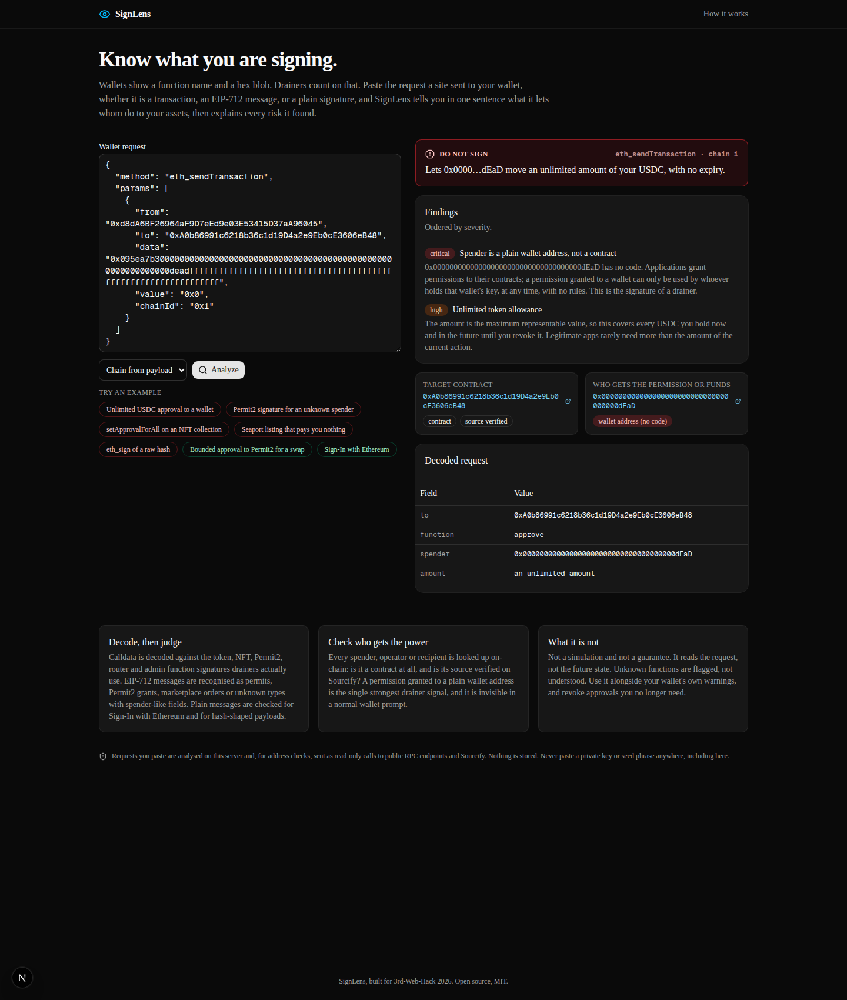

# SignLens

Know what you are signing. Paste the request a dApp sent to your wallet, a
transaction, an EIP-712 typed-data message, or a plain signature request, and
get one plain-English sentence saying what it lets whom do with your assets,
followed by every risk found and who the counterparty really is.

Built for 3rd-Web-Hack 2026. Open source, MIT.



## The problem

Wallet prompts show a function name, an address, and hex. Approval phishing
lives in that gap: a page says "verify your wallet" and the prompt says
`approve`, `setApprovalForAll`, `PermitBatch`, or `securityUpdate`. The
permission then goes to an address the user never sees evaluated. Signature
drainers took hundreds of millions of dollars from users this way, and the
loss is irreversible the moment the signature exists.

## What SignLens does

1. **Parses** what wallets receive: JSON-RPC `eth_sendTransaction`,
   `eth_signTypedData_v4`, `personal_sign`, `eth_sign`, EIP-5792
   `wallet_sendCalls` batches, bare transaction objects, bare typed data, or raw
   calldata.
2. **Decodes** calldata against the functions drainers use (ERC-20 approvals
   and transfers, ERC-721/1155 approvals and transfers, EIP-2612 `permit`,
   Permit2 `approve`, multicall, Universal Router `execute`, proxy admin
   functions, and the reassuringly named `securityUpdate`/`claimReward`
   selectors), and typed data as EIP-2612 permits, Permit2 `PermitSingle`,
   `PermitBatch`, `PermitTransferFrom` and batch variants, Seaport orders,
   or unknown types with spender-like fields. Plain messages are checked for
   Sign-In with Ethereum and for hash-shaped payloads.
3. **Checks the counterparty on-chain**: is the spender/operator/recipient a
   contract or a plain wallet (`eth_getCode`), and is its source verified on
   Sourcify. A permission granted to a codeless address is the strongest
   drainer signal there is, and no wallet prompt shows it.
4. **Judges** with explicit rules: unlimited amounts, no expiry, collection-wide
   approvals, zero-consideration listings, Permit2-shaped messages from
   non-Permit2 contracts, ETH attached to approvals, `eth_sign`, domain/URI
   mismatch in sign-in messages. Every finding carries a severity and a
   one-paragraph explanation written for a person, not an auditor.

The verdict is the highest severity found: **Do not sign**, **High risk**,
**Check carefully**, **Minor notes**, or **Looks routine**.

## Running it

```bash
npm install
npm run dev        # http://localhost:45177
npm test           # 23 engine tests, offline
npm run lint
```

No API keys. Address checks use keyless public RPC endpoints
(`publicnode.com`) and Sourcify's public API; both are optional and degrade to
"not checked" if unreachable. Nothing pasted is stored.

Deep links preload an example: `/?example=drainer-approve`,
`permit2-drain`, `set-approval-for-all`, `zero-price-listing`, `eth-sign`,
`swap-approve`, `siwe`.

### API

```
POST /api/analyze
{ "input": "<json-rpc request | tx | typed data | calldata>", "chainId": 1 }
```

Returns a `Report`: `verdict`, `summary`, `findings[]`, `decoded[]`,
`target`, `counterparty`, `token`, and `children[]` for batches. `chainId`
is only needed when the payload carries none.

## Layout

```
src/lib/analyze/parse.ts     accepts every payload shape wallets receive
src/lib/analyze/known.ts     function ABIs, known contracts and tokens, explorers
src/lib/analyze/analyze.ts   decoding, rules, summaries
src/lib/analyze/enrich.ts    on-chain and Sourcify lookups (server only, cached)
src/lib/analyze/format.ts    amounts, deadlines, unlimited detection
src/lib/analyze/*.test.ts    engine tests with an offline enricher
src/app/api/analyze          the endpoint
src/components/analyzer.tsx  the UI
```

## Limits

- It reads the request, not the outcome. It does not simulate execution or
  balance changes.
- Unknown functions are flagged as unknown, not understood.
- The known-contract list is small and hand-maintained; a verified,
  well-known contract that is not on the list shows as "contract, source
  verified" rather than by name.
- Heuristics can be wrong in both directions. Treat the verdict as a second
  opinion next to your wallet's own checks, and revoke approvals you no longer
  need.

## Why this is different from a wallet's built-in warnings

Wallet warnings are yes/no and unexplained, and they cannot be used before
connecting a wallet to a suspicious site. SignLens works on the pasted request,
explains its reasoning field by field, and puts the counterparty's on-chain
status next to the permission being granted. It is a teaching tool as much as
a filter.
